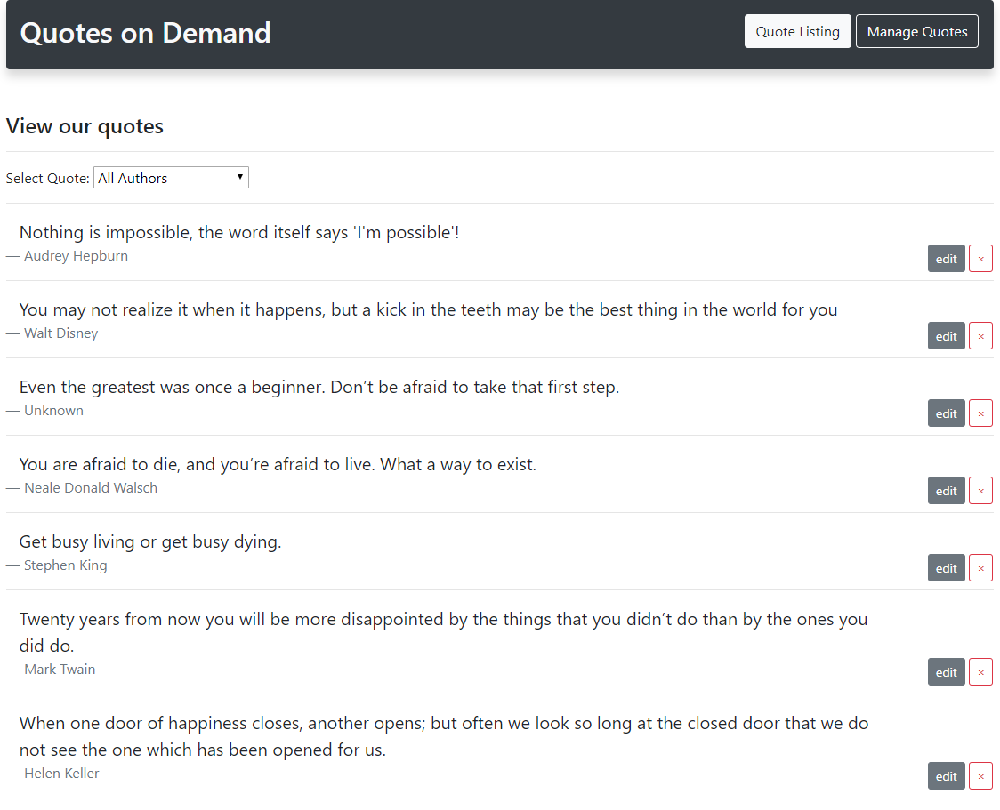

# quotes on demand with python

A fully featuerd VueJS application consuming and saving data to and from a third party API server.

## The Why

This application was created with a couple goals in mind.

1. Create a working Vue application without using a build system or module loader such as the
   Vue CLI or Webpack yet still keep the templates and javascript together.

2. Incorporate as much as the standard Create, Read, Update and Delete functionality as possible
   within the application and still keep it simple and usable.

3. Have the application be able to consume a third party Application Programming Interface (API)
   hosted outside of the root of the User Interface application.

## Instructions

Since Quotes on Demand is technically two applications there are a few steps to do before running the application. This application was created using VS Code, so not all steps are applicable.

1.  Change into the API directory and run the command `python app.py` to start up the application. 
    Further instructions can be found within the `README.md` file for that application.

2.  For the UI directory there are no actual dependencies needed to run the front end. Though you must
    be able to serve up the index.html file. There were two VS Code extensions I used for development
    which were instrumental in making this application easy to build.

    1.  Extension 1 - `LIVE SERVER` this extension will take any html page and serve it up from a hot
        reloadeable webserver. Any changes made will refresh the browser. Very much like the `live-server` npm package used with node.

    2.  Extension 2 - `TEMPLATE LITERAL EDITOR` because this application did not use a build system for
        putting together the html and javascript for deployment the template literal editor was used to
        give us the ability to edit our Vue html easily and without having to touch the actual literal templates. This worked out well because with a simple selection a new editor window opened with the html, changes could be made, the window would be closed and the template was updated.

3.  With the two extensions installed, the api folder's dependenices downloaded you are now ready to run the application. Type ` run app.py` to run your program from a console within the API folder and this will start up the server.
    From within the UI folder, right click on the index.html file and choose the option of `Open with live server`. The API server will be found on port 5000 and the UI application should be served on port 5500 both on localhost.

## Notes

You do not need to have the live server extension installed to run the UI project. You can use any method you would like to serve up static files to a browser. This could include using a nodeJS server to serve static files, you can use a LAMP server or even a local instance of IIS.

That was the goal of this project, be able to deploy a Vue web application without any extra dependencies other than the actual application itself. We think we succeeded!
